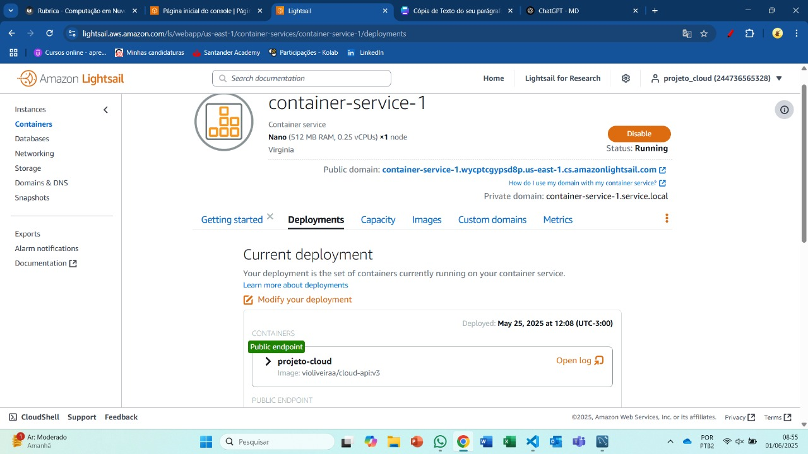
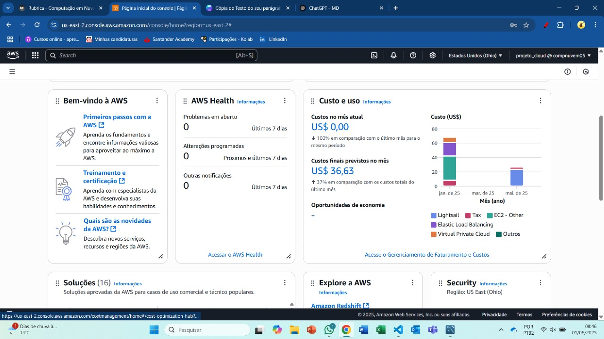
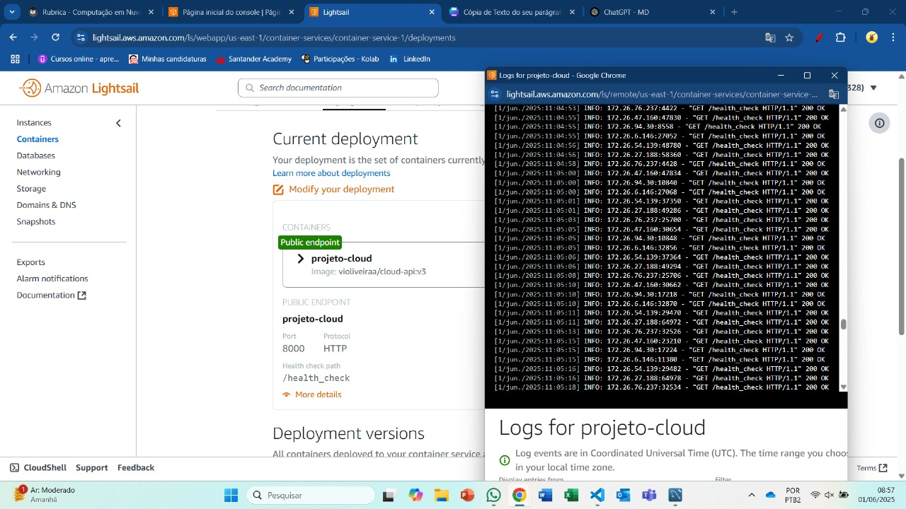
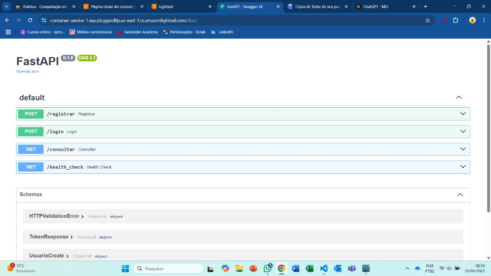

# Documentação Técnica da API - Projeto Cloud

## Visão Geral

Este projeto é uma API RESTful desenvolvida com **FastAPI**, estruturada para realizar:

- Registro e autenticação de usuários com proteção por **JWT**;
- Consulta a dados externos atualizados via **web scraping** (ex: índice Bovespa);
- Armazenamento seguro dos dados e usuários com **PostgreSQL**;
- Implantação via **Docker Compose** e **AWS Lightsail**.

---

## Estrutura dos Arquivos

- `main.py`: ponto de entrada da aplicação.
- `app.py`: definição da API, endpoints e rotas.
- `models.py`: modelos de dados SQLAlchemy.
- `schemas.py`: validação de entrada/saída via Pydantic.
- `auth.py`: lógicas de autenticação, hash e geração/validação de token JWT.
- `database.py`: configuração da conexão com PostgreSQL via variáveis de ambiente.
- `scrapping.py`: script de coleta e inserção de dados do índice Bovespa.
- `.env`: (não incluso no repo) armazena as variáveis sensíveis (como senha e host do banco).

---

## Funcionamento da API

### Endpoints Disponíveis

#### 1. `POST /registrar`

Cria um novo usuário, desde que o email ainda não esteja cadastrado. A senha é armazenada como **hash** com bcrypt, e um **JWT** é gerado no retorno.

**Request**:
 <!-- termynal -->
        {
        "nome": "João",
        "email": "joao@insper.edu.br",
        "senha": "senhaSegura123"
        }

**Response**:
 <!-- termynal -->
        {
        "jwt": "<token_jwt_gerado>"
        }

#### 2. `POST /login`
Autentica o usuário com email e senha. Se as credenciais forem válidas, retorna um novo JWT válido por 1 hora.

**Request**:

<!-- termynal -->
        {
        "email": "joao@insper.edu.br",
        "senha": "senhaSegura123"
        }

**Response**:

<!-- termynal -->
        {
        "jwt": "<token_jwt_gerado>"
        }
Fluxo:

- Verifica se o email existe no banco;

- Compara a senha fornecida com o hash armazenado usando bcrypt;

- Se válidas, gera e retorna um novo JWT.

#### 3. `GET /consultar`
Retorna dados externos coletados via scraping (simulação: índice Bovespa). Requer autenticação via JWT passado no cabeçalho.

<!-- termynal -->

Authorization: Bearer <token_jwt>
**Response**

<!-- termynal -->
        {
        "dados": "Últimos 10 dias do índice Bovespa (simulado)"
        }
Fluxo:

- Extrai o token JWT do cabeçalho;

- Valida o token com a chave secreta e algoritmo definidos;

- Se válido, realiza scraping no site configurado (InfoMoney);

- Retorna os dados extraídos ao usuário autenticado.

#### 4. `GET /health-check`
Verifica se a API está ativa e funcionando corretamente. É útil para o monitoramento em produção (ex: AWS Lightsail).

**Response**

<!-- termynal -->

        {
        "statusCode": 200,
        "timestamp": "2024-09-16T12:00:00Z",
        "hostname": "ip-172-16-0-12"
        }
Fluxo:

- Retorna sempre um status HTTP 200;

- Inclui informações de data/hora e hostname;

- Pode ser usado como verificação de saúde automática pela AWS.

/// caption
Endpoints testados
///

### Dockerização da API

Para garantir a portabilidade e facilitar a execução da aplicação em diferentes ambientes, a API foi dockerizada. Isso significa que tanto a aplicação quanto o banco de dados são executados em contêineres isolados, usando o Docker Compose para orquestração.

## Obejtivos dessa etapa:

- O objetivo da dockerização é permitir que qualquer pessoa possa executar a aplicação localmente (ou em produção) com apenas um comando:

<!-- termynal -->
        docker compose up -d

Com isso, dois serviços principais são inicializados:

- app: a aplicação FastAPI

- database: o banco de dados PostgreSQL

## Estrutura de diretório
<!-- termynal -->
        api/
        ├── Dockerfile
        ├── requirements.txt
        ├── app/
        │   └── app.py
        ├── ...
        compose.yaml
        .env

- Dockerfile: define como a imagem da aplicação será construída.

- compose.yaml: descreve e conecta os serviços da aplicação (API e PostgreSQL).

- .env: armazena variáveis sensíveis como credenciais do banco (não incluído no repositório público).

- requirements.txt: lista as dependências Python da aplicação.

## Funcionamento do Docker Compose

Ao executar:
<!-- termynal -->
        docker compose up -d

O Docker Compose realiza os seguintes passos:

1. Inicia o container do banco de dados PostgreSQL;

2. Inicia o container da aplicação FastAPI (baseada na imagem gerada a partir do Dockerfile);

3. Garante que a aplicação consegue se conectar ao banco por meio da rede definida no Compose.

## Publicação no Docker Hub

Após validar que a aplicação funcionava corretamente via Docker Compose, foi feita a publicação da imagem no Docker Hub. Isso permite que a imagem da aplicação possa ser reutilizada diretamente no AWS Lightsail, sem necessidade de reconstrução.

#### Passos para publicação

1. Build da Imagem:
<!-- termynal -->
        docker build -t <nome da sua imagem> .

2. Login no Docker Hub:
<!-- termynal -->
        docker login

3. Push para o Docker Hub:
<!-- termynal -->
        docker push <nome da sua imagem>

Com isso, a aplicação se tornou totalmente autocontida, podendo ser executada com um simples comando. Esse processo garante:

- Reprodutibilidade do ambiente;

- Facilidade de deploy em nuvem;

- Separação entre código-fonte e infraestrutura;

## Implantação no AWS Lightsail (Etapa 2)

A segunda etapa do projeto consiste em publicar a API desenvolvida em um ambiente de produção, utilizando a plataforma de nuvem **AWS Lightsail**. Esta fase valida a capacidade do aluno de colocar sua aplicação no ar com infraestrutura real e segura.

---

### 1. Implantação da Aplicação com AWS Lightsail Container Service

A API FastAPI foi implantada como **container** dentro do serviço "Container Service" do AWS Lightsail. A imagem da aplicação, previamente publicada no Docker Hub, foi referenciada diretamente na configuração do container.

**Configurações utilizadas:**

- **Service name**: `container-service-1`  
- **Power**: Micro (suficiente para aplicação de testes e com menor custo)  
- **Scale**: 1 instância (para minimizar o custo)  
- **Public Endpoint**: habilitado para permitir acesso externo

Através desse processo, a aplicação ficou disponível online, acessível por um domínio gerado automaticamente pela AWS (Nosso link: `container-service-1.wycptcgypsd8p.us-east-1.cs.amazonlightsail.com`).

/// caption
Infra rodando na AWS
///
---

### 2. Configuração do Banco de Dados Gerenciado (PostgreSQL)

Além da aplicação, foi criado um banco de dados gerenciado do tipo **PostgreSQL** diretamente no painel do AWS Lightsail. Essa abordagem traz vantagens como:

- **Backups automáticos**
- **Alta disponibilidade**
- **Gerenciamento facilitado via painel AWS**

**Configurações utilizadas:**

- **Database name**: `fastapi-db`
- **Engine**: PostgreSQL
- **Master username**: `admin`
- **Senha**: (armazenada via variável de ambiente)
- **Public mode**: Ativado (para permitir acesso do container)

Foi importante garantir que a **zona de disponibilidade (AZ)** do banco coincidisse com a da aplicação, otimizando latência e performance.

---

### 3. Conexão da Aplicação ao Banco

Para conectar a API ao banco, foi necessário configurar corretamente as **variáveis de ambiente** na tela de deploy do container no Lightsail.

/// caption
Custos no dia 1/06/2025
///

/// caption
Health_check funcionando
///

## Link do video da aplicação funcionando 

/// caption
Endpoints funcionando
///
https://youtu.be/QvdRbJoUZag

