## Objetivo
O objetivo deste roteiro é detalhar a implementação de uma infraestrutura de nuvem utilizando MAAS (Metal as a Service) para configurar servidores físicos. O projeto envolve a configuração de sub-redes, integração com APIs, e a implementação de uma aplicação Django na nuvem. O foco é automatizar o gerenciamento de hardware, permitindo expansão e flexibilidade no deploy de serviços.

## Instalando o MAAS:
Antes de instalar o MAAS, foi necessário configurar cada NUC com um IP estático e garantir que todos os devices estivessem conectados ao switch e ao roteador fisicamente. O ambiente de rede foi criado para que todas as NUCs pudessesem estabelecer conexão e se comunicar entre elas e com a main. Foi utilizado um pendrive para instalar o Ubuntu 22.04 LTS na main MAAS. Após a instalação do Ubuntu, O MAAS foi instalado na main utilizando o seguinte comando executado no terminal:

<!-- termynal -->

``` bash
sudo snap install maas --channel=3.5/Stable
```


Após a instalação da MAAS, implantou-se um banco de dados teste que proporciona um ambiente para testar novas configurações, permite práticas seguras sem riscos para a operação principal. Além disso, facilita a criação de backups e restaurações rápidas, garantindo a estabilidade da infraestrutura enquanto ocorrem novos desenvolvimentos.

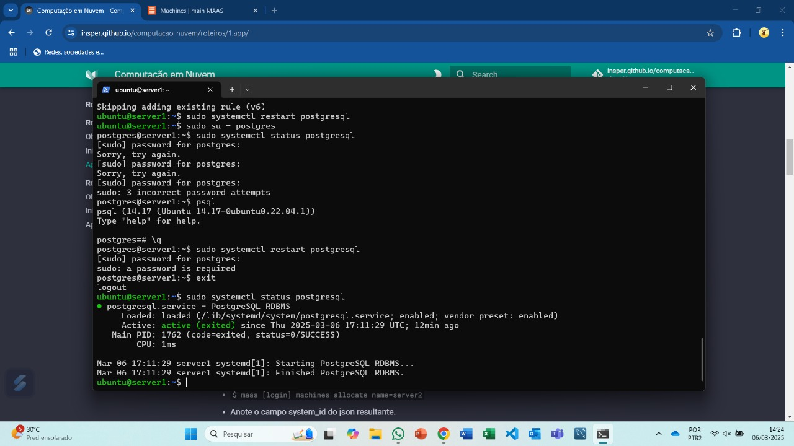
/// caption
Banco de dados Ativo para o Sistema Operacional
///

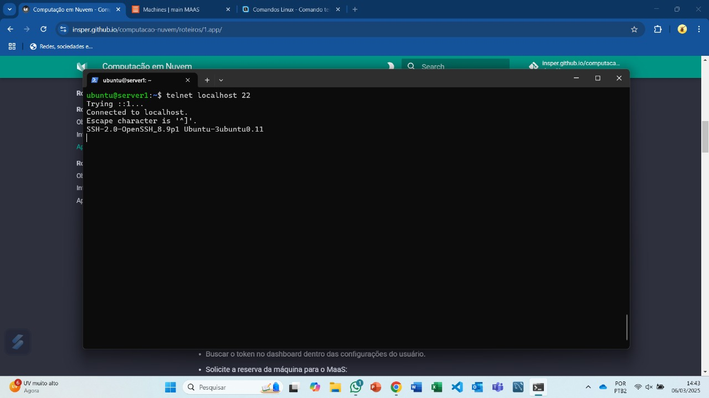
/// caption
Banco de dados acessível na máquina em que foi implementado
///

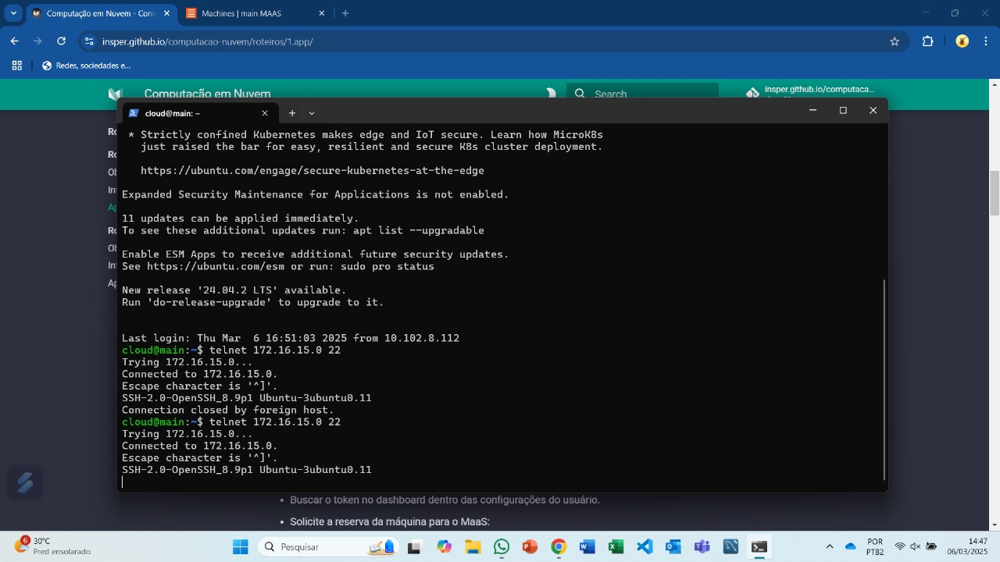
/// caption
Banco de dados acessivel a partir de uma conexão vinda da máquina MAIN
///

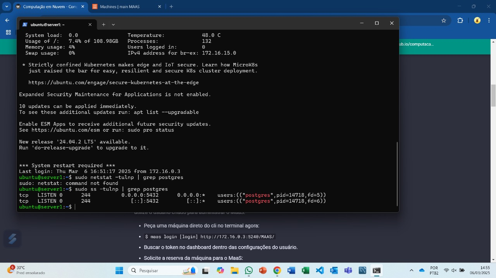
/// caption
Porta em que o Banco de dados está funcionando
///

Para garantir que tudo foi feito com êxito o dashboard foi acessado através do navegador pelo IP configurado (http://172.16.0.3:5240/MAAS) que posteriormente foi atualizado para um novo endereço de IP (http://10.103.1.13:5240/MAAS). Essa mudança foi necessária  para que a rede externa (do Insper) reconhecesse a máquina principal main como dispositivo ponte para a subrede de NUCs permitindo que a infraestrutura operasse dentro da rede interna e externamente, aumentando a flexibilidade. 

A configuração do DNS nessa etapa garantiu que as solicitações para a nova URL do MAAS fossem direcionadas para o IP atualizado. Comandos de ping para o gateway e para a internet foram usados para testar a conexão e garantir que a rede estava configurada corretamente, possibiltando a comunicação com o mundo externo e entre as máquinas. Assim, 


## Configuração das Machines
Cada servidor NUC foi configurado dentro do sistema da MAAS em várias etapas para garantir que cada uma estivesse pronta para ser integrada à infraestrutura de nuvem. Para cada servidor, as configurações de MAC address e IP do AMT foram registradas no dashboard do MAAS. O registro do MAC address identifica cada dispositivo na rede, enquanto o IP do AMT permite o gerenciamento remoto dos servidores, permitindo ações através desse IP dedicado ao AMT. 

Foram ajustadas as configurações de rede de cada servidor, incluindo a definição de IPs estáticos onde necessário, e a configuração de sub-redes para facilitar a comunicação entre os servidores e com a rede externa. Assim, para possibilitar acesso remoto, implementou-se um NAT para conectar o servidor principal "main" à rede Wi-Fi do Insper. Para reduzir a necessidade de duas interfaces de rede físicas criou-se cinco OVS bridges na interface 'enp1s0' a partir da configuração de um nó para cada para, desta maneira, garantir que o OVN Chassis possa ser acomodado por qualquer nó.


## Django
A implementação do Django foi realizada em um dos servidores que já haviam sido provisionados e comissionados com o sistema operacional Ubuntu 22.04 LTS, instalado através do MAAS. O Django e as bibliotecas necessárias foram instalados, incluindo o Django framework, um adaptador de banco de dados PostgreSQL. O PostgreSQL foi instalado no mesmo servidor onde o Django estava sendo configurado. Após a configuração, configurou-se o serviço para que ele iniciasse automaticamente com o sistema.
As configurações de listen_addresses no arquivo postgresql.conf foram ajustadas para '0.0.0.0', permitindo que o servidor de banco de dados aceitasse conexões de qualquer IP dentro da rede. Regras de firewall foram configuradas para permitir tráfego na porta padrão do Django (8000) e na porta do PostgreSQL (5432), garantindo que ambos pudessem comunicar-se com outras máquinas na rede interna e.


## Criação de túneis
Para tornar o acesso remoto à aplicação Django mais seguro, foi configurado um túnel SSH. Essa configuração permitiu o acesso à aplicação de forma segura, mesmo estando fora do ambiente local. Utilizando este túnel, todas as solicitações passam por uma conexão criptografada, assegurando que os dados permaneçam protegidos. Utilizando o comando SSH, um túnel foi estabelecido redirecionando a porta local do computador de um desenvolvedor para a porta do servidor onde o Django estava operando.


/// caption
Dashboard do MAAS com as máquinas
///

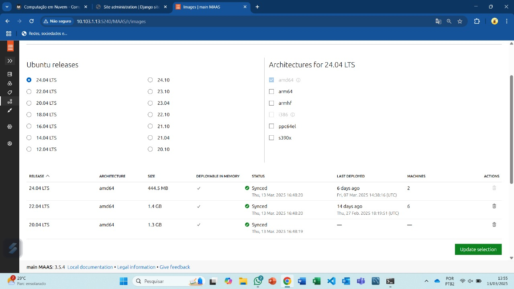
/// caption
imagens do MAAS sincronizadas
///

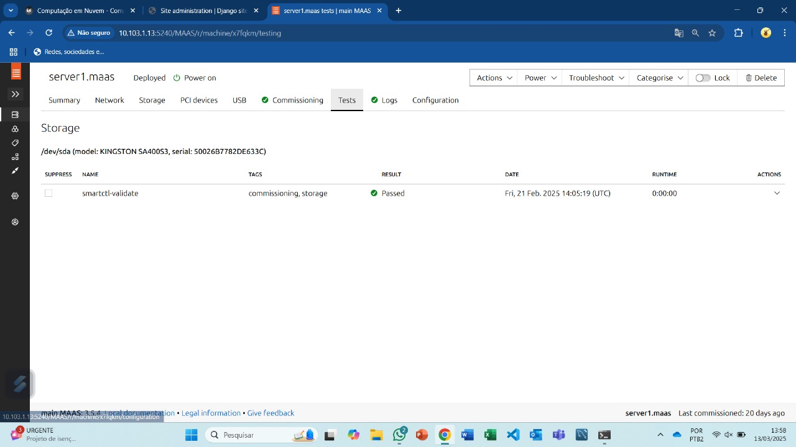
/// caption
Testes de hardware da server1
///

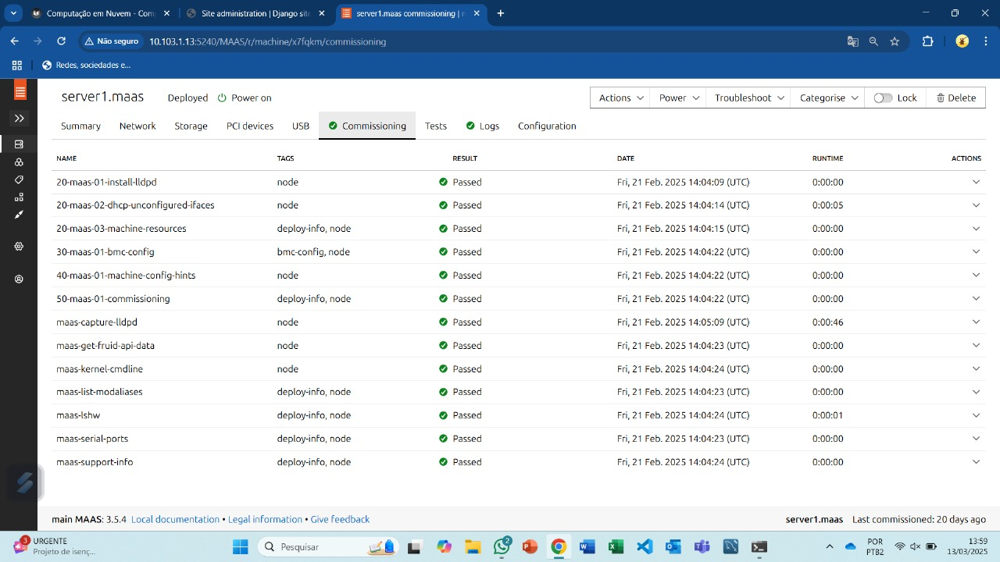
/// caption
Commissioning da server1 com status "OK"
///

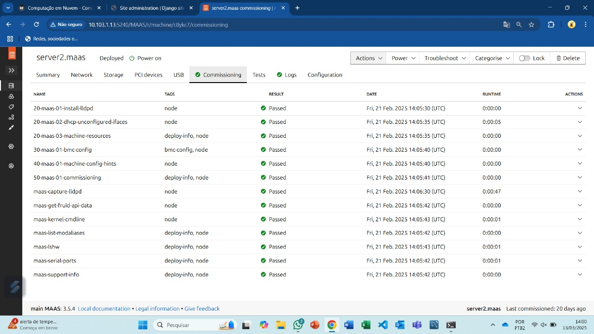
/// caption
Testes de hardware da server2
///

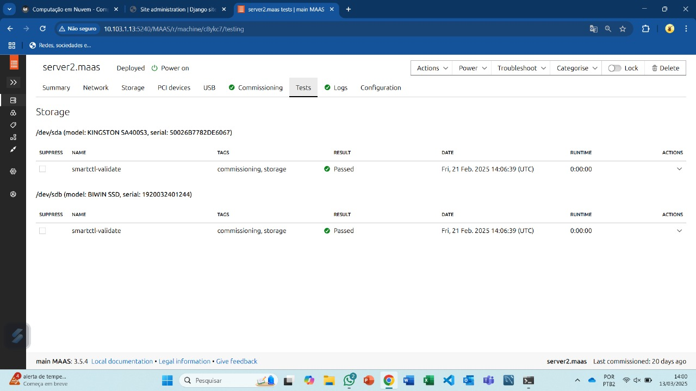
/// caption
Commissioning da server2 com status "OK"
///


/// caption
Testes de hardware da server3
///

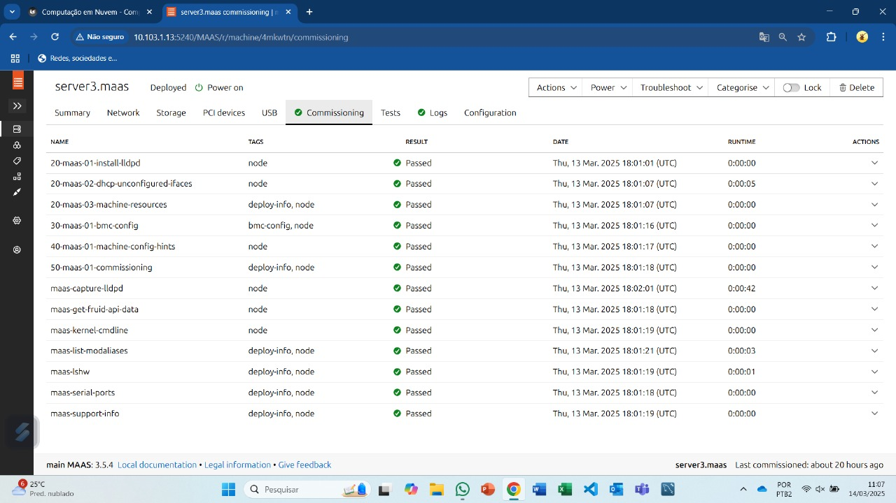
/// caption
Commissioning da server3 com status "OK"
///

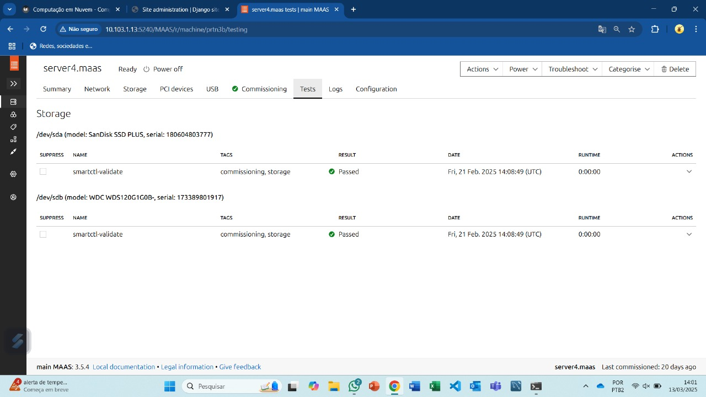
/// caption
Testes de hardware da server4
///


/// caption
Commissioning da server4 com status "OK"
///

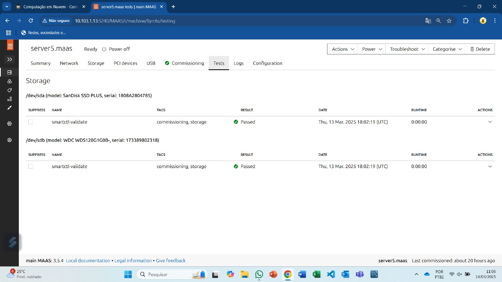
/// caption
Testes de hardware da server5
///

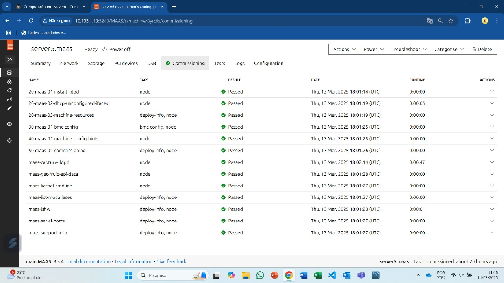
/// caption
Commissioning da server5 com status "OK"
///

## Ansible e Deploy automatizado
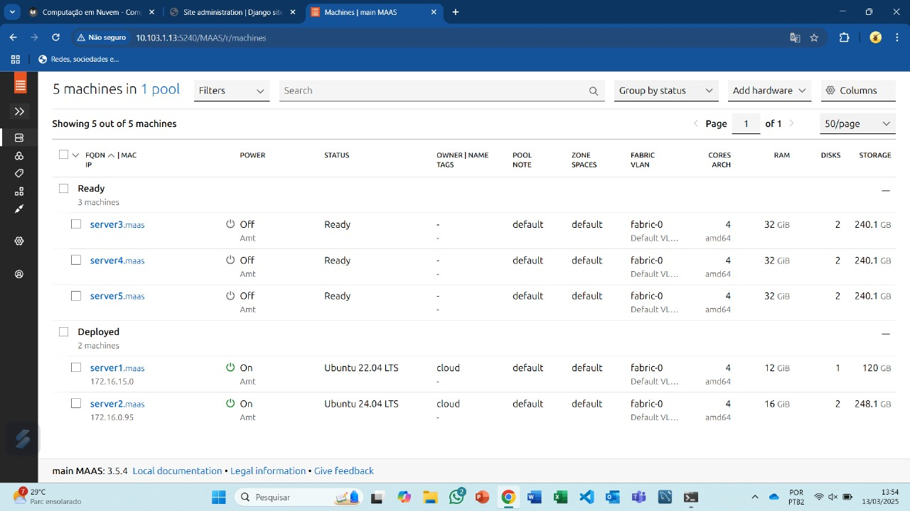
/// caption
Dashboard do MAAS com as 2 Maquinas e seus respectivos IPs
///
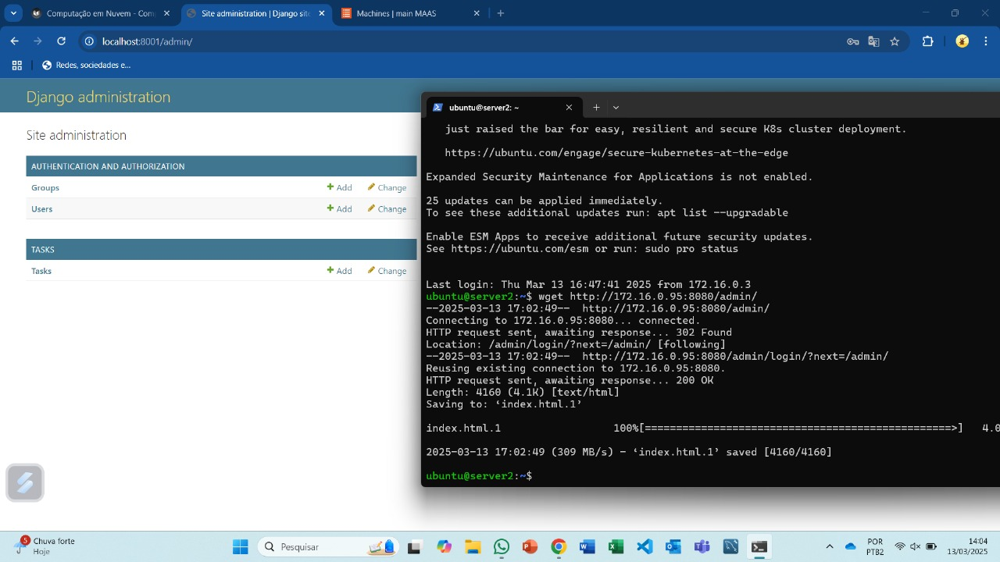
/// caption
Aplicacao Django, provando a conexão com o server2
///

O Django e o PostgreSQL foram instalados em servidores separados, iniciando-se com a preparação do ambiente. No servidor do Django, um ambiente virtual foi configurado para gerenciar as dependências, e o Django foi instalado junto com as bibliotecas necessárias. Para o banco de dados, o PostgreSQL foi instalado em seu próprio servidor. O sistema foi configurado para aceitar conexões de qualquer IP e foi criado um usuário dedicado para o Django, garantindo uma gestão segura e eficiente do banco de dados. As conexões foram definidas no arquivo de configuração do Django para assegurar uma boa comunicação entre a aplicação e o banco de dados.

Antes de implementar o balanceamento de carga, o deployment das aplicações Django nos servidores foi automatizado usando Ansible, que melhora a eficiência e a confiabilidade dos processos de implantação. O Ansible faz com que os mesmos comandos podem ser executados várias vezes sem alterar o estado do sistema, permite gerenciar e configurar várias máquinas ao mesmo tempo além de ser eficaz na gestão de máquinas virtuais e contêineres.

Com os deploys sendo gerenciados automaticamente, asseguramos que as aplicações Django em server2 e server3 sejam atualizadas e configuradas corretamente. Isso minimiza o tempo de inatividade, mantendo os serviços acessíveis e operacionais, mesmo se ocorrer uma falha em um dos nós.

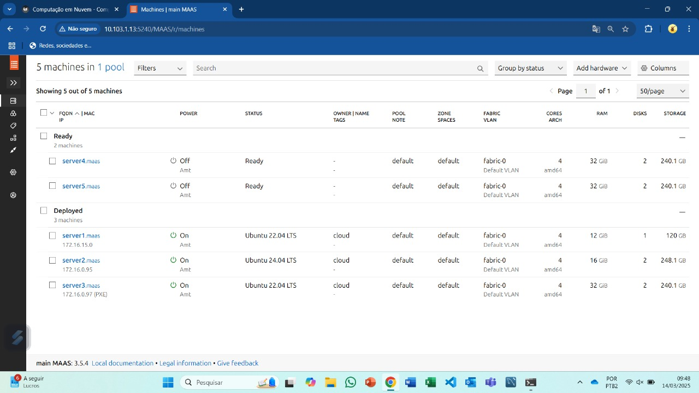
/// caption
Dashboard do MAAS com as 3 Maquinas e seus respectivos IPs.
///


/// caption
Evidenciando a conexão com server2
///

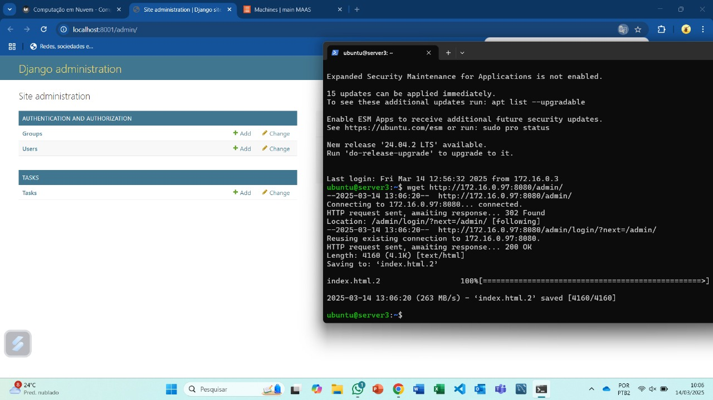
/// caption
Evidenciando a conexão com server3
///

Ao utilizar o Ansible para instalar o Django, há um aumento da eficiência e consistência do sistema. Enquanto a instalação manual está sujeita a erros e variações, o Ansible automatiza e padroniza o processo, fazendo com que todas as instalações sejam feitas da mesma forma em todos os servidores. Isso ajuda na possibilidade de futuras mudanças ou atualizações, além de ser mais rápido, permitindo que alterações sejam feitas da mesma maneira em toda a infraestrutura.

## Configuração do Load Balancer
Para garantir eficiência no tráfego de rede para o Django, foi configurado um balanceador de carga usando NGINX no server4, que foi configurado para funcionar como um proxy reverso e balanceador de carga, ou seja, distribuir as solicitações de rede entre os server2 e server3. Assim, cada nova solicitação HTTP foi configurada para ser enviada alternadamente entre esses dois servidores.

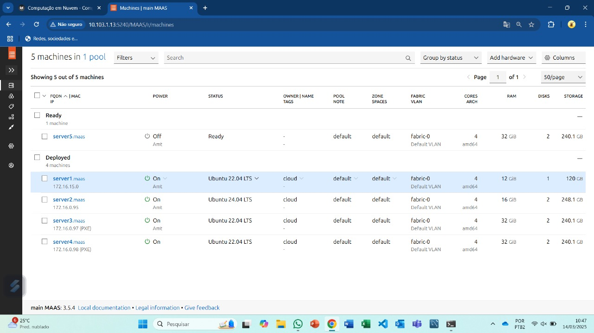
/// caption
Dashboard do MAAS com as 4 Maquinas e seus respectivos IPs
///

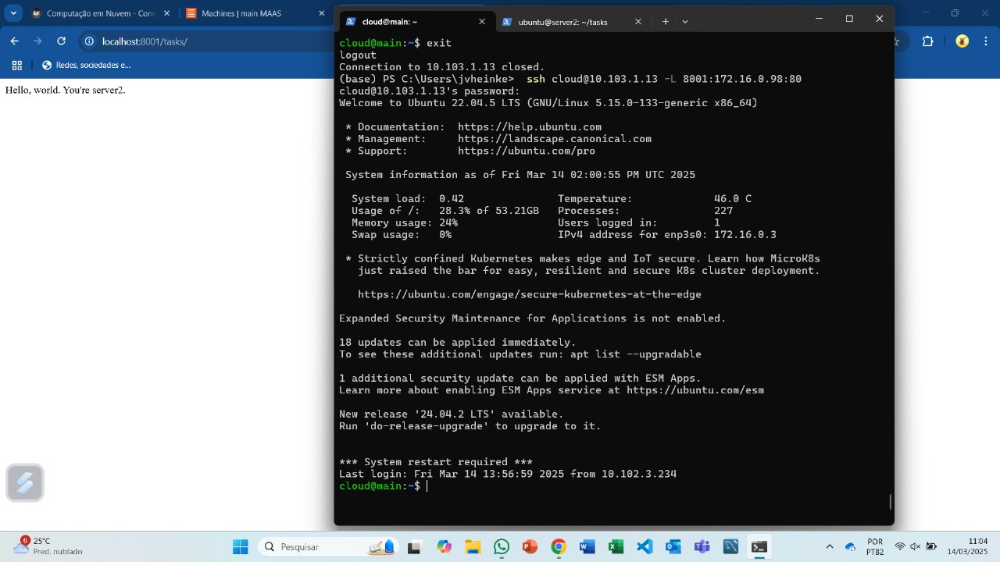
/// caption
Server 4 batendo no sever2 em um request
///


/// caption
Server 4 batendo no sever3 em um request seguinte
///

Após a finalização de todo esse processo, realizou-se o Release de todos os nós.


## Discussões
Os principais desafios incluíram a configuração da rede entre os dispositivos, especialmente o ajuste do roteador e do switch para operar corretamente com o MAAS e garantir a comunicação entre os servidores.

A realização deste projeto proporcionou um aprofundamento significativo nos conceitos de rede, gerenciamento de hardware com MAAS e configuração de aplicações em um ambiente bare-metal. A experiência prática com estas tecnologias ofereceu um entendimento valioso sobre a automação e o gerenciamento de infraestrutura física.

## Conclusão

O projeto alcançou com sucesso o objetivo de configurar uma infraestrutura de nuvem bare-metal automatizada, que gerencia hardware físico e implanta serviços de forma flexível e escalável. Esta infraestrutura está preparada para futuras expansões ou para ser utilizada em outros projetos que requerem um ambiente robusto e configurável.
