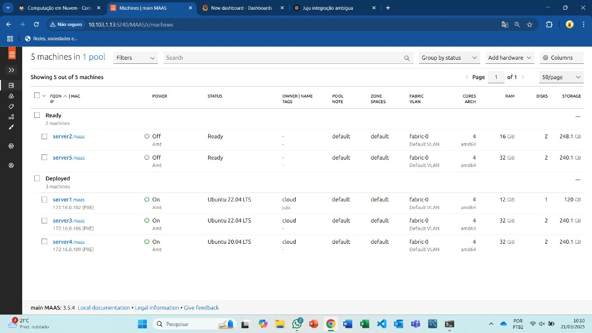
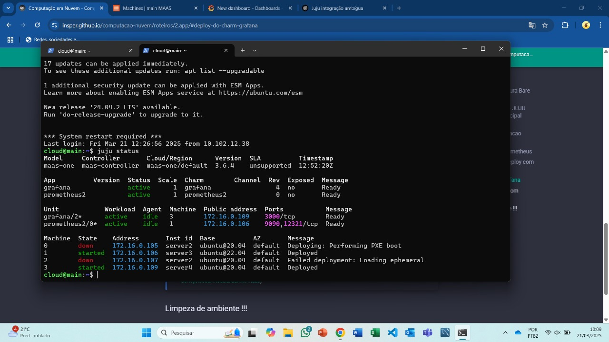
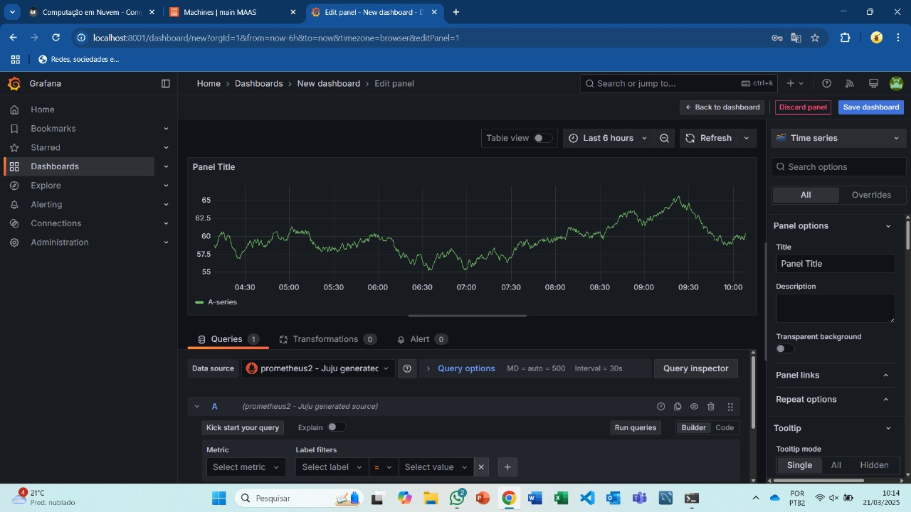
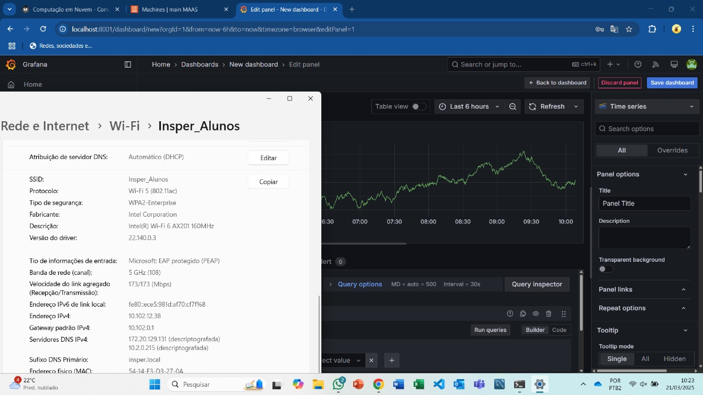
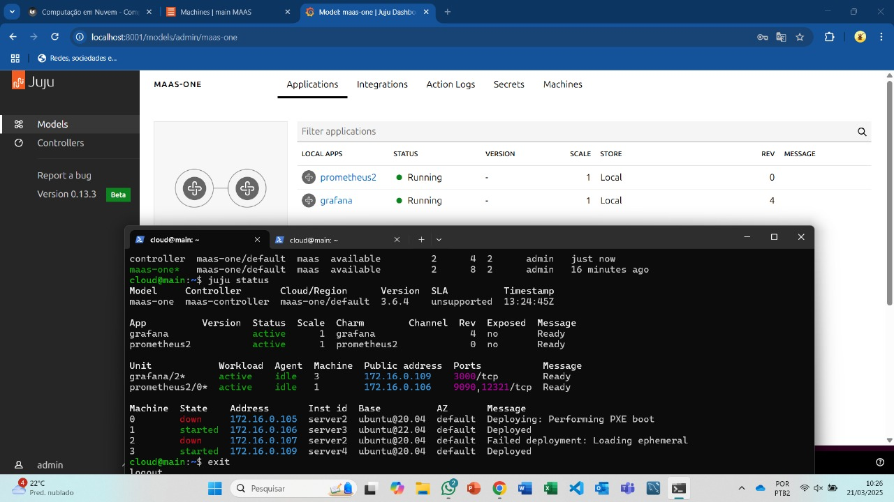

## Objetivo

O objetivo deste trabalho foi realizar a orquestração de deployment (Deployment Orchestration) de aplicações distribuídas (neste caso, Grafana e Prometheus) em uma infraestrutura bare metal, utilizando o MAAS (Metal as a Service) como provedor de máquinas físicas e o Juju como orquestrador. Durante este trabalho, todo o processo foi realizado com o objetivo de explorar, na prática, o conceito de Deployment Orchestration, onde conseguimos gerenciar, automatizar e monitorar a alocação de recursos e o funcionamento de aplicações complexas como Grafana e Prometheus em um ambiente real.

## Instalação do Juju
O primeiro passo foi a instalação do Juju na máquina principal da rede, a main. Essa máquina serviu como ponto de partida para repassar comandos e distribuições às NUCs (server1, server2, server3, server4, server5). Utilizou-se o seguinte comando para garantir que a versão mais recente (3.6) fosse instalada corretamente:

<!-- termynal -->

``` bash
    sudo snap install juju --channel 3.6
```

## Verificação e Integração com o MAAS
Foi necessário integrar o Juju com o MAAS, permitindo que ele o reconhecesse como um provedor de cloud. Para verificar se o Juju já reconhecia o MAAS usou-se o comando juju clouds. Como não houve o reconhecimento automático, foi necessário adicionar manualmente uma definição de cloud via o arquivo maas-cloud.yaml: 

``` bash
clouds:
  maas-one:
    type: maas
    auth-types: [oauth1]
    endpoint: http://192.168.0.3:5240/MAAS/
```


Esse arquivo informa ao Juju o endpoint do MAAS, além do tipo de autenticação usada (oauth1). O arquivo foi adicionado ao Juju com o seguinte comando.


<!-- termynal -->
``` bash
    juju add-cloud --client -f maas-cloud.yaml maas-one
``` 

Esse arquivo foi adicionado com

<!-- termynal -->

``` bash
juju add-cloud --client -f maas-cloud.yaml maas-one
```

Criou-se o arquivo maas-creds.yaml com a chave OAuth gerada no painel do MAAS para que o Juju possa interagir com a nova cloud adicionada:

``` bash
    credentials:
        maas-one:
            anyuser:
            auth-type: oauth1
            maas-oauth: <API_KEY>
```  

Adicionou-se as credenciais com

<!-- termynal -->

``` bash
juju add-credential --client -f maas-creds.yaml maas-one
```

## Criação do Controller

Para provisionar corretamente o controller em uma máquina física: Atribuiu-se a tag juju à máquina server1 pelo painel do MAAS. Em seguida, executamos o bootstrap do controller com o comando:

<!-- termynal -->

    juju bootstrap --bootstrap-series=jammy --constraints tags=juju maas-one maas-controller

Esse processo envolve a alocação da máquina, instalação do sistema operacional (Ubuntu), instalação do Juju Agent e configuração inicial da cloud privada. O controlador do Juju é o componente central que gerencia toda a infraestrutura Juju: ele rastreia os modelos, máquinas, aplicações, estados, etc. 

## Acesso ao Dashboard 
Com o controller funcional, instalou-se o Dashboard do Juju para facilitar a visualização dos deploys e do status das aplicações. O acesso ao dashboard foi realizado através da porta 8080 via um túnel SSH, o que permitiu operar a interface mesmo estando fora da rede do KIT. Ainda, também criou-se uma máquina virtual com Ubuntu, usada para auxiliar no controle e nos testes de acesso aos serviços.

## Aplicação
O Juju foi essencial para a realização do deploy do Grafana, responsável pela visualização e do Prometheus, responsável pela coleta de métricas. Realizou-se o deploy de ambas as aplicações. O Grafana é uma plataforma de código aberto que simplifica a apresentação visual de dados, como gráficos e painéis, facilitando a compreensão em tempo real de sistemas e informações. Para funcionar, o Grafana requer um banco de dados para armazenar configurações, metadados e informações relacionadas à exibição de dados em seus painéis e gráficos. No caso utilizamos o Prometheus como banco de dados.

Para a realização do deploy, primeiro foi necessário criar o diretório charm do Grafana e Prometheus e dentro dele baixar, localmente, os charms das duas aplicações (Grafana e Prometheus). Um charm é um pacote que automatiza a implantação, configuração e gerenciamento de aplicações em ambientes baseados no Juju. Com os arquivos .charm de ambas as aplicações, executou-se os deploys para cada um deles, iniciando o processo de instalação automatizada nas máquinas disponíveis. Após o deploy ser realizado, foi necessário fazer a integração do Grafana com o Prometheus, utilizando um túnel. A integração é necessária para que o Grafana reconheça o Prometheus como uma fonte de dados válida.

Por fim, realizou-se a limpeza do ambiente com o comando juju destroy-controller, encerrando o controller e liberando os recursos físicos alocados no MAAS.



/// caption
Dashboard do MAAS com as Maquinas e seus respectivos IPs
///


/// caption
Comando "juju status" com o Grafana "active"
///


/// caption
Dashboard do Grafana com o Prometheus como source
///


/// caption
Evidência do acesso ao Dashboard pela rede do Insper
///



/// caption
Aplicações sendo gerenciadas pelo JUJU (http://IP-Serviço:8080/models/admin/maas)
///


## Conclusão
O trabalho demonstrou como é possível orquestrar aplicações distribuídas em uma infraestrutura bare metal utilizando MAAS para o provisionamento de máquinas físicas e Juju para o deploy automatizado. Após superar desafios como o recommissionamento da server1 e a configuração de tags, conseguimos implantar e integrar com sucesso o Grafana e o Prometheus. A integração permitiu a visualização das métricas em tempo real, validando a operação dos serviços. No geral, a atividade mostrou a eficiência do uso combinado de MAAS e Juju na gestão e automação de ambientes físicos complexos.