## Objetivo
O relatório teve como objetivo documentar o processo de implantação e configuração de uma nuvem privada baseada em OpenStack, utilizando MAAS para provisionamento de hardware e Juju para orquestração de charms. Foram apresentados conceitos de infraestrutura (computação, rede, armazenamento), deployment de serviços essenciais (Ceph, Nova, Keystone, Neutron etc.) e uso da plataforma para criação de máquinas virtuais e aplicações.


## Criação da Infraestrutura
Criou-se as brigdes em todas os servers e depois colocou-se as tags exigidas em cada uma (controller, reserva, compute, compute, compute). Verificou-se que o OVS bridge br-ex estava presente em todos os nós e conectado à interface física correta, garantindo a comunicação externa do OpenStack.

## Implantação do OpenStack
### Juju controller 
Instalou-se o controller no server1 (que recebeu a tag controller) com o comando:

<!-- termynal -->
``` bash
juju bootstrap --bootstrap-series=jammy --constraints tags=controller maas-one maas-controller
```

### Definição do Modelo de Deploy

Definimos o modelo de deploy

-- Internamente, o Juju reserva um namespace lógico (openstack) para agrupar as aplicações (charms), máquinas virtuais e relações que vão compor a nuvem OpenStack.

-- Muda o contexto de operação do seu client Juju para apontar ao model openstack no controller chamado maas-controller.

Criou-se e selecionou-se o model openstack sobre o controller recém-bootstrapped:
<!-- termynal -->
``` bash
juju add-model --config default-series=jammy openstack
juju switch maas-controller:openstack
```

-- Após esse comando, todo comando juju status, juju deploy, juju add-machine etc. será executado no model openstack daquele controller, sem que você precise especificar de novo a qual controller/model está se referindo.

- a todo momento, faz-se necessário conferir o status da instalacao do open stack com o comando:
<!-- termynal -->
``` bash
watch -n 2 --color "juju status --color"
```

ou a partir de:

<!-- termynal -->
``` bash
juju status --color
```   


### OSD (Object Storage Daemon)
Cada OSD é responsável por gerenciar e servir os dados armazenados em discos locais 
- criamos o arquivo ceph-osd.yaml que configura quais discos serão usados como OSDs (Object Storage Daemons) em todos os nós. 
cria três unidades (units) da aplicação ceph-osd., aplica as configurações definidas no arquivo e escala as unidades somente em nós "compute"

### Nova compute
O nova compute é o componente do OpenStack responsável por criar e gerenciar as máquinas virtuais nos servidores físicos.


### MYSQL InnoDB Cluster
O MySQL InnoDB Cluster exige sempre, no mínimo, três réplicas de banco de dados. O operador implanta a aplicação mysql-innodb-cluster em três nós, utilizando o charm correspondente. Cada instância será executada dentro de um container LXD nas máquinas identificadas como 0, 1 e 2, garantindo a instalação da versão estável do MySQL. Dessa forma, assegura-se alta disponibilidade e tolerância a falhas, pois o cluster mantém três cópias sincronizadas dos dados.

### Vault
Vault é responsável por gerar e gerenciar os certificados TLS que garantem comunicação criptografada entre os serviços da nuvem. Certificado TLS é um documento digital que vincula uma chaves criptográfica com uma identidade, garantindo conexão ao servidor para um cliente confiável, permite que o cliente e o servidor troquem dados sem possibilidade de interceptação externa e assegura integridade dos dados. Para realizar o comando export VAULT_ADRESS usou-se o comando juju status pra identificar em qual máquina o Vault teria sido instalado. 

### Neutron Networking
O Neutron implementou a rede virtual por meio dos charms neutron-api, neutron-api-plugin-ovn, ovn-central e ovn-chassis. Foi configurado o mapeamento do bridge externo (br-ex) para o provedor plano “physnet1” e implantadas instâncias dos componentes OVN no cluster LXD. Por fim, todas as relações foram estabelecidas para integrar o serviço de rede ao plano de controle OVN, às máquinas de computação e ao Vault para certificados TLS, garantindo conectividade e segurança das VMs.

### Keystone
O Keystone centralizou a autenticação e autorização de usuários, sendo executado em container no nó designado. Ele foi conectado ao banco de dados do cluster MySQL e ao Vault para obtenção de certificados TLS, além de fornecer serviço de identidade ao Neutron e demais componentes por meio de relações diretas, tornando possível o gerenciamento seguro e centralizado de credenciais na nuvem.

### RabbitMQ
Para orquestração de mensagens, o broker RabbitMQ foi executado em container no nó 2. Após sua instalação, criaram-se ligações AMQP tanto com o serviço de rede Neutron quanto com o componente de computação Nova, permitindo que eventos de rede e instância transitassem de forma confiável entre os componentes da nuvem.

### Nova Cloud Controller
O controlador de nuvem Nova, responsável pelo agendamento de instâncias, APIs de computação e condução de operações internas, foi instalado em container no nó 2. Sua configuração apontou o Neutron como gestor de rede, integrando-o ao banco de dados e ao RabbitMQ para comunicação e persistência. Em seguida, estabeleceram-se relações com Keystone (identidade), Neutron (serviço de rede), RabbitMQ (mensageria), Nova Compute (controle de ciclo de vida das VMs) e Vault (certificados), completando o ecossistema de computação da nuvem.

### Placement
O serviço Placement, encarregado de rastrear recursos físicos e virtuais disponíveis para novas instâncias, foi implantado em container no nó 2. Ele foi conectado ao banco de dados da nuvem, ao Keystone para autorização de identidade e ao controlador Nova para fornecer informações sobre alocação de recursos, garantindo que a orquestração de instâncias levasse em conta a capacidade disponível.

### Horizon (Dashboard do OpenStack)
O painel de controle gráfico Horizon foi instalado em container no nó 2, oferecendo interface web unificada para administração e uso da nuvem. Após a implantação, o Horizon foi vinculado ao banco de dados e ao Keystone para autenticação de usuários, permitindo que administradores e usuários acompanhassem facilmente o status de VMs, redes e volumes por meio do browser.

### Glance
O serviço de imagens Glance foi executado em container no nó 2, gerenciando o repositório de imagens de máquinas virtuais. Ele foi integrado ao banco de dados, ao Keystone para controle de acesso, ao Vault para certificados e ao Nova Compute para permitir que instâncias fossem inicializadas a partir das imagens armazenadas, além de se conectar ao Ceph como backend de armazenamento para eficiência e escalabilidade.

### Ceph Monitor
Para compor o cluster de armazenamento distribuído Ceph, o componente de monitoramento (ceph-mon) foi instalado em três containers LXD distribuídos nos primeiros três nós. O monitor foi configurado para reconhecer três OSDs e manter quorum entre si. Posteriormente, estabeleceu-se relações entre o monitor e os OSDs, bem como conexões ao serviço de computação Nova e ao Glance, de modo que o Ceph servisse como backend unificado de armazenamento para imagens e discos das VMs.

### Cinder
O serviço de blocos Cinder foi implantado em container no nó 1, configurado para não gerenciar diretamente dispositivos (block-device: None) e usar a API Glance v2. Ele foi integrado ao banco de dados, ao Keystone, ao RabbitMQ e ao Glance para snapshots de volumes, e ao Nova Cloud Controller para prover volumes de inicialização. Em seguida, adicionou-se o charm subordinado cinder-ceph, conectando-o ao Ceph Monitor para que os volumes fossem armazenados em RADOS, garantindo alta disponibilidade e desempenho.

### Ceph RADOS Gateway
Como alternativa ao Swift, o gateway RADOS do Ceph foi instalado em container no nó 0, oferecendo compatibilidade S3 e Swift. Após sua implantação, ele foi relacionado ao Ceph Monitor, habilitando acesso HTTP aos objetos armazenados, útil para aplicações que exigem interface de objeto em nuvem.

### Integração Final do Ceph-OSD
Após validar o status estável de todas as unidades OSD, ajustou-se a configuração do Ceph-OSD para utilizar exclusivamente o dispositivo /dev/sdb, consolidando o layout de armazenamento e otimizando o uso de discos nos nós de computação.

## Conclusçao da implantação 
Aguardou-se a convergência do comando de status até que não houvesse mensagens de erro ou pendências. A nuvem foi considerada operacional com sucesso. Como próximos passos, recomendou-se o upgrade dos charms para as versões estáveis mais recentes, a padronização das séries de sistema operacional em todos os nós e a adoção de práticas oficiais de backup, recuperação de desastres e manutenção contínua da plataforma.

## Configuração do OpenStack
Exportou-se o arquivo openrc com credenciais de administrador.

### Autenticação
Autenticou-se via:
<!-- termynal -->
``` bash
      source ~/openrc
```

### Horizon
Acessou-se o Horizon pelo browser para acompanhar alterações em tempo real.

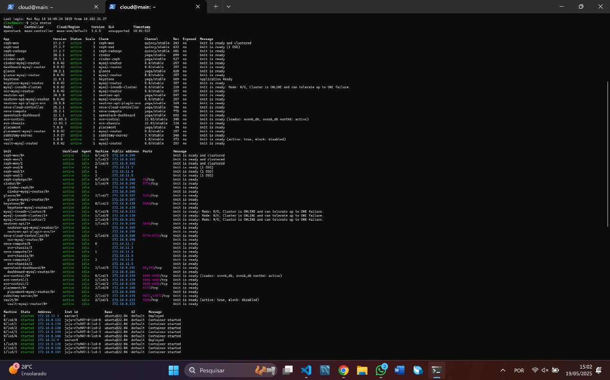
/// caption
Juju Status
///

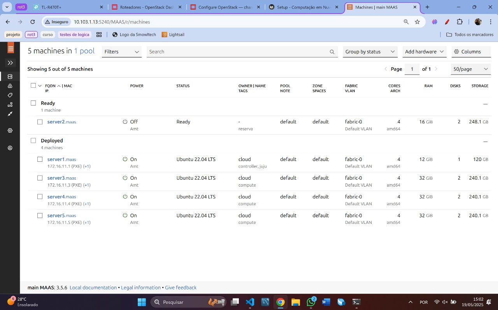
/// caption
 Dashboard do MAAS com as máquinas
///

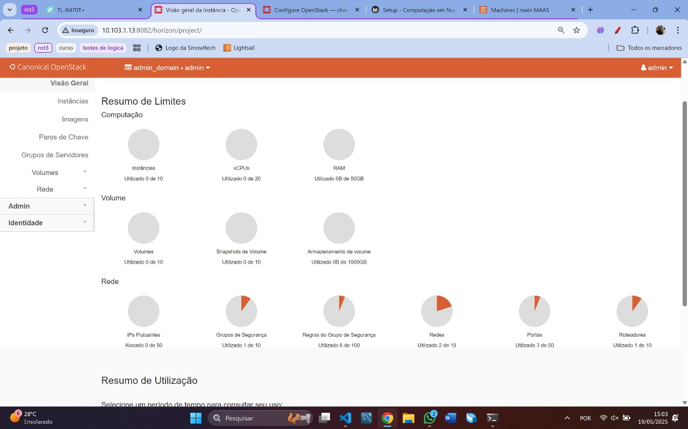
/// caption
Compute overview
///

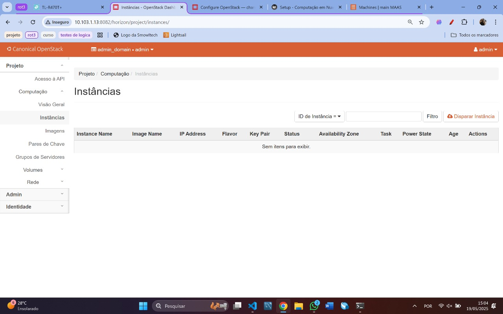
/// caption
Compute instances
///

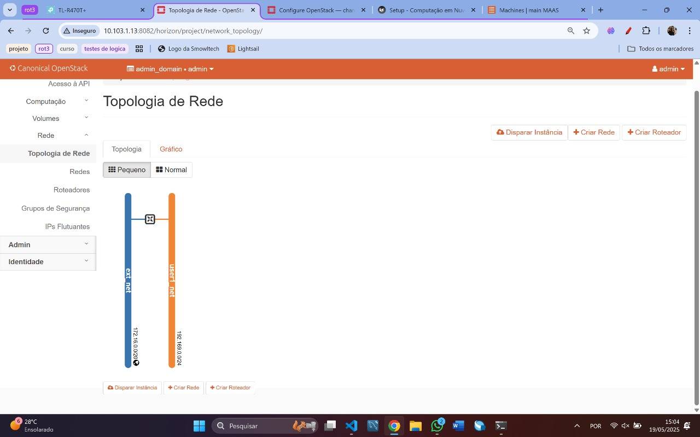
/// caption
Network topology
///


### Imagens e Flavors
As imagens representaram o sistema operacional base e qualquer software pré-instalado que seria usado para inicializar novas máquinas virtuais (VMs). Foi importada uma imagem “Jammy” (Ubuntu 22.04) no Glance, o serviço de imagens do OpenStack, o qual armazenou o arquivo QCOW2 em seu repositório. Sempre que uma instância foi criada, o Nova buscou essa imagem no Glance e a copiou para o armazenamento do compute, garantindo que todas as VMs partissem de um mesmo template, facilitando a padronização, a atualização de software em massa e a recuperação rápida de sistemas.


Instalou-se o cliente OpenStack

<!-- termynal -->
``` bash
sudo snap install openstackclients
```

Carregou-se credenciais com
<!-- termynal -->
``` bash
source openrc
```
Importou-se imagem Jammy
<!-- termynal -->
``` bash
openstack image create --public --container-format bare \
  --disk-format qcow2 --file ~/cloud-images/jammy-amd64.img \
  jammy-amd64
```
e, por fim, criou-se flavors sem disco efêmero com os comandos
<!-- termynal -->
``` bash
openstack flavor create --ram 1024 --disk 20 m1.tiny
openstack flavor create --ram 2048 --disk 20 m1.small
openstack flavor create --ram 4096 --disk 20 m1.medium
openstack flavor create --ram 8192 --disk 20 m1.large
```


Os flavors definiram os perfis de hardware virtual disponíveis aos usuários, especificando quantidades fixas de CPU, memória RAM e disco em cada tipo de instância. Criaram-se quatro flavors—m1.tiny, m1.small, m1.medium e m1.large—com incrementos graduais de recursos (vCPUs de 1 a 4, RAM de 1 GB a 8 GB e disco de 20 GB). Ao solicitar uma nova VM, o usuário escolheu um flavor adequado à carga de trabalho; o Nova então alocou recursos físicos conforme aquele perfil, simplificando o controle de custos e o balanceamento de capacidade no ambiente.


### Rede Externa
Configurou-se a rede externa. Usando uma faixa de alocação entre 172.16.7.0 e 172.16.8.255

<!-- termynal -->
``` bash
openstack network create --external --share \
  --provider-network-type flat --provider-physical-network physnet1 \
  ext_net

openstack subnet create --network ext_net --no-dhcp \
  --gateway 172.16.7.1 --subnet-range 172.16.7.0/24 \
  ext_subnet
```

### Rede Interna e Roteador¶
Criou-se a rede interna e o roteador, usando a subnet 192.169.0.0/24 sem DNS. Na criacao da rede externa e da subrede, foi essencial a criação de um roteador pra conectá-las. O roteador é o responsável por encaminhar o tráfego entre a rede interna e a externa, permitindo que as instâncias na rede interna acessem a internet e vice-versa. 

<!-- termynal -->
``` bash
openstack network create --internal user1_net
openstack subnet create --network user1_net \
  --subnet-range 192.169.0.0/24 \
  user1_subnet

openstack router create user1_router
openstack router add subnet user1_router user1_subnet
openstack router set user1_router --external-gateway ext_net
```

### Conexão SSH e Security Groups
Importou-se um par de chaves SSH para o OpenStack, permitindo acesso às VMs sem senha, e criou-se um grupo de segurança que liberou somente porta 22 (SSH) e ICMP. Assim, cada instância aceitou apenas logins autenticados por chave.
Precisa de par de chaves porque quando ocorre a criação da maquina virtual, não há permissão para acessá-la. Assim, o par de chaves insere uma chave publica do MAAS na maquina para que, assim, libere o acesso.

### Criação de Instâncias
Em seguida, foi lançada uma nova máquina virtual com o menor perfil (m1.tiny), nomeada “client”. Após a VM ficar ativa, atribuiu-se um endereço flutuante da rede pública, permitindo acesso externo via Internet. Esse IP público foi associado à interface de rede da instância. Por fim, testou-se a conexão SSH usando a chave privada local apontada para o usuário padrão, confirmando que a máquina virtual estava operacional e acessível de forma segura de qualquer ponto autorizado na rede.


## Comparações entre os processos

Visão Geral de Computação

- Na Tarefa 1, todas as quotas (instâncias, vCPUs, RAM) estavam zeradas.
- Na Tarefa 2, já havia 5 instâncias ativas, ocupando 5 vCPUs e 5 GB de RAM.

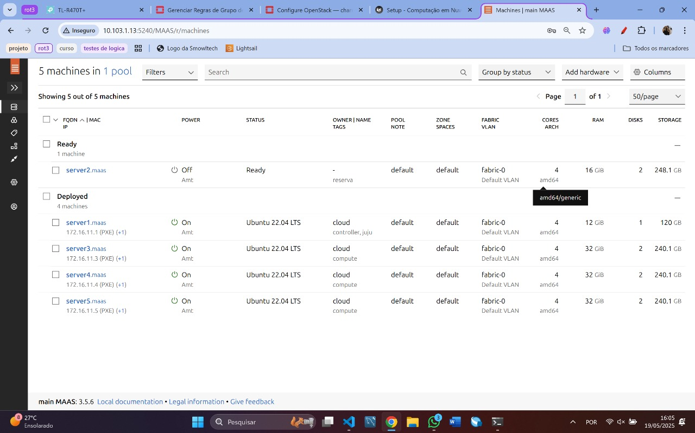
/// caption
 Dashboard do MAAS com as máquinas
///

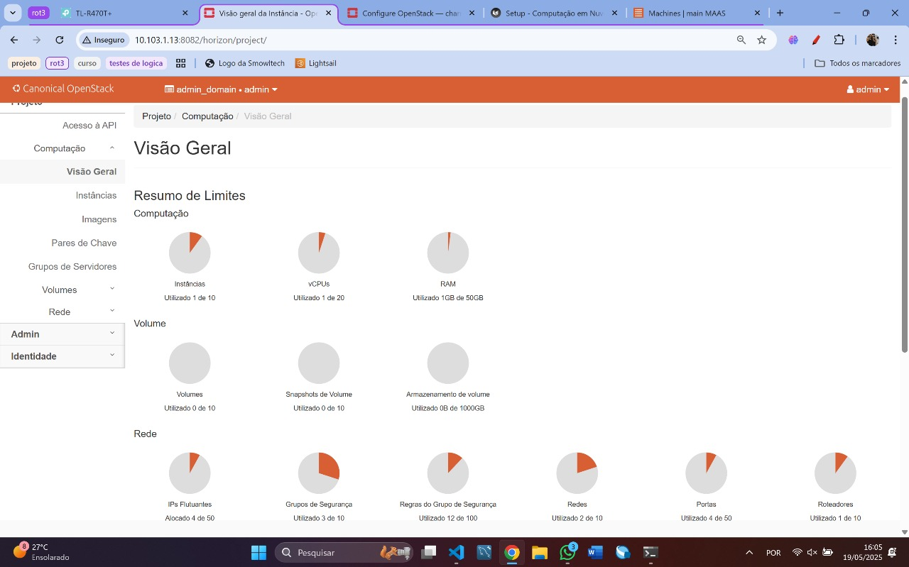
/// caption
Compute overview
///

Instâncias

- Antes, não havia nenhuma máquina criada.
- Depois, surgiram cinco VMs (“postgres”, “nginx”, “api1”, “api2” e “client”), todas em m1.small exceto “client” em m1.tiny, cada uma com IP interno e floating IP.


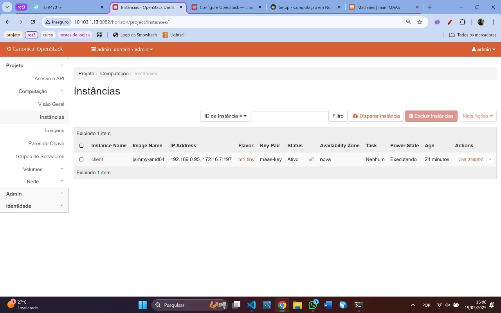
/// caption
Compute instances
///

Topologia de Rede

- Inicialmente, só apareciam rede externa e interna ligadas por um roteador.
- Em seguida, mostraram-se também as portas de cada instância na rede interna e os ícones de floating IP na rede externa.

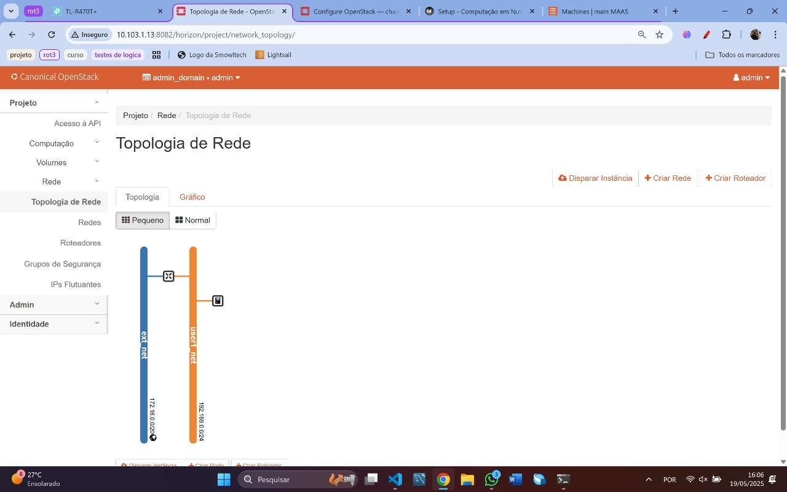
/// caption
Network topology
///


Security Groups & Floating IPs

- No começo, havia apenas o grupo padrão com regras básicas (SSH e ICMP) e nenhum IP flutuante.
- Depois, o grupo ganhou mais regras e todos os cinco floating IPs foram alocados e associados às VMs.


## Escalonamento de Nós
Para aumentar a capacidade e a resiliência da nuvem, foi realizada a integração de nós adicionais de computação e armazenamento. Inicialmente, verificou-se no painel do MAAS a existência de uma máquina alocada em reserva; em seguida, liberou-se esse nó para uso pelo OpenStack.

Em seguida, executou-se o deploy do hypervisor no novo nó de compute, adicionando uma unidade ao serviço Nova Compute:

<!-- termynal -->
``` bash
juju add-unit nova-compute
```

Após identificar o ID da máquina recém-incorporada pelo comando juju status, procedeu-se à expansão do armazenamento distribuído, implantando uma unidade OSD do Ceph naquele mesmo nó:
<!-- termynal -->
``` bash
juju add-unit --to <machine-id> ceph-osd
```

Dessa forma, ganhou-se capacidade de processar mais VMs simultâneas, distribuir automaticamente cargas de trabalho e melhorar a tolerância a falhas por meio de escalabilidade horizontal.


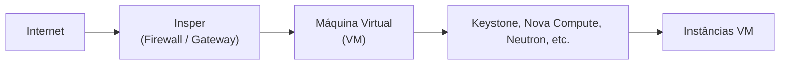

[Mermaid](https://mermaid.js.org/syntax/architecture.html){:target="_blank"}


## Construção e Containerização da API

Para conclusão do projeto, desenvolveu-se uma API RESTful em FastAPI para gerenciar usuários e consultar dados de terceiros via scraping. A API foi containerizada usando Docker, permitindo fácil implantação e escalabilidade. O código fonte da API foi organizado em um repositório Git, com um Dockerfile para construção da imagem e um docker-compose.yml para orquestração dos containers.
A API oferece os seguintes endpoints:

Registrar usuários (POST /registrar).

Autenticar usuários (POST /login).

Consultar dados de terceiros via scraping (GET /consultar).

Health check (GET /health-check) -> evidencia com qual API o load balancer está se comunicando.


## Aplicação do Load Balancer
Para garantir alta disponibilidade e balanceamento de carga entre as instâncias da API, foi configurado um load balancer que distribui as requisições entre duas instâncias da API. As instâncias da API foram criadas para permitir que múltiplas instâncias possam ser executadas simultaneamente para lidar com um maior volume de requisições. Isso melhora a performance e a resiliência do sistema, garantindo que, mesmo se uma instância falhar, as outras continuem operando e atendendo os usuários. 

Além disso, foram criadas instâncias do banco de dados PostgreSQL e do load balancer. 

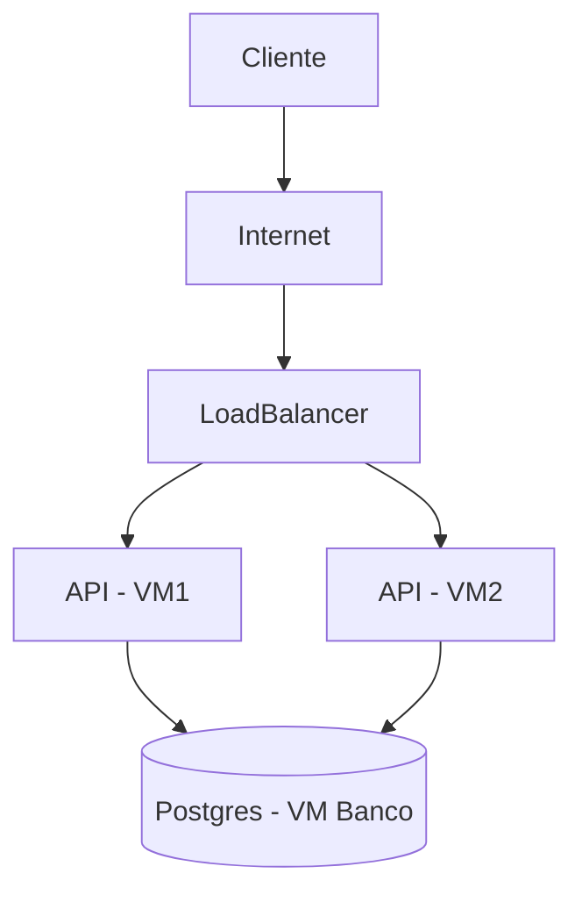

[Mermaid](https://mermaid.js.org/syntax/architecture.html){:target="_blank"}


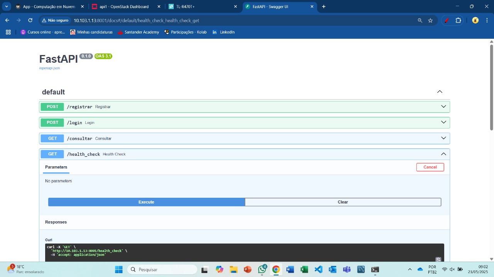
/// caption
Dashboard do FastAPI
///


/// caption
Demonstração do server em que a instância da API1 está alocada
///


/// caption
Demonstração do server em que a instância da API2 está alocada
///

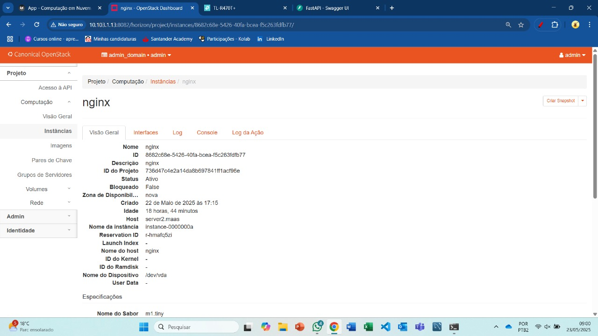
/// caption
Demonstração do server em que a instância do load balancer está alocada.
///

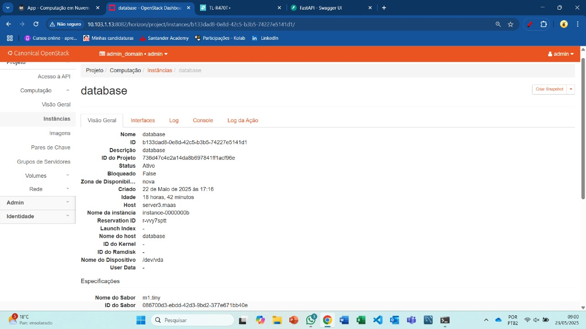
/// caption
Demonstração do server em que a instância do banco de dados está alocada.
///

## Conclusão
A implantação do OpenStack com MAAS e Juju demonstrou ser uma solução robusta para criar uma nuvem privada escalável e gerenciável. A integração de componentes essenciais como Ceph, Nova, Keystone e Neutron permitiu a construção de uma infraestrutura de computação em nuvem eficiente, capaz de suportar cargas de trabalho variadas. A containerização da API em FastAPI facilitou a gestão de usuários e a consulta de dados, enquanto o uso de charms simplificou o processo de orquestração e manutenção dos serviços. A experiência adquirida neste projeto é valiosa para futuras implementações e otimizações em ambientes de nuvem privada.
Demonstrou-se a importância de:

Escolher flavors adequados para custo e desempenho.

Seguir boas práticas de segurança (hash de senhas, variáveis de ambiente).

Documentar endpoints e automações com Diagrama Mermaid.

Automatizar tudo via Juju e Docker para reprodutibilidade.

O projeto consolida conhecimentos em infraestrutura, DevOps e desenvolvimento Web.