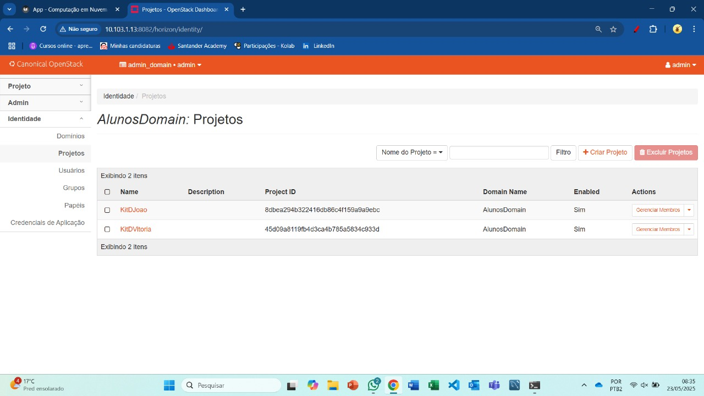
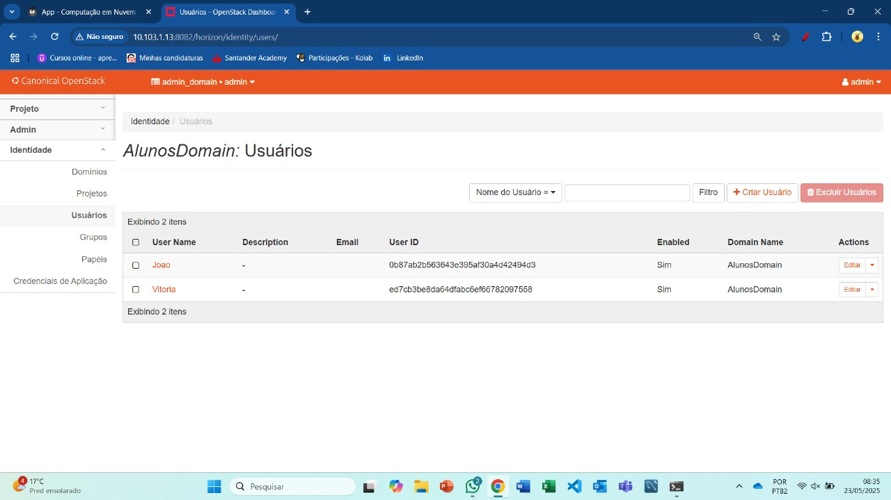
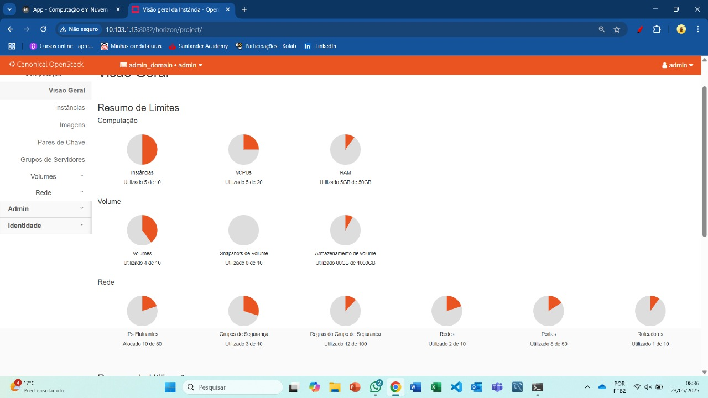
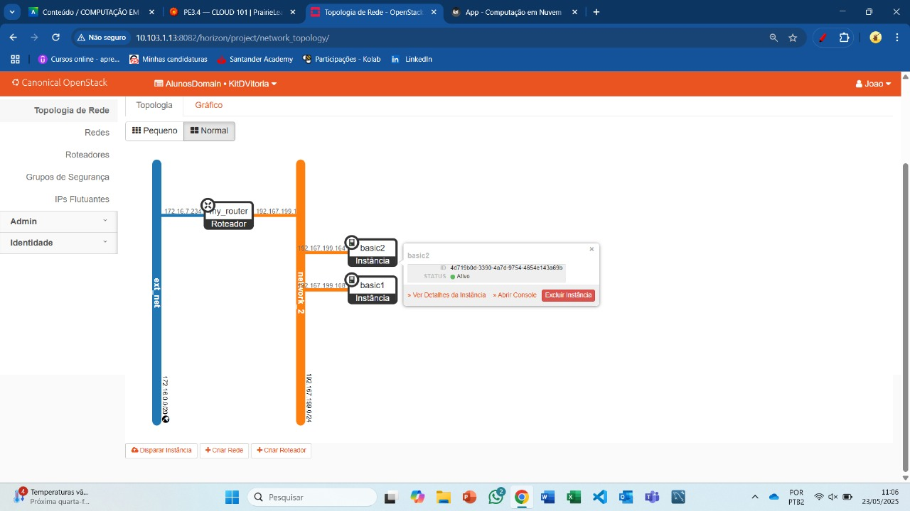

# Relatório - Infraestrutura como Código e OpenStack

## Objetivo

O objetivo deste trabalho foi aplicar os conceitos de Infraestrutura como Código (IaC) utilizando a ferramenta Terraform, além de compreender a estrutura de gerenciamento de projetos no OpenStack. Para isso, realizamos a criação hierárquica de domínios, projetos e usuários no painel Horizon, seguidos do provisionamento de infraestrutura automatizado com Terraform, com a separação lógica de recursos por aluno.

## Conceitos de Infraestrutura como Código (IaC)

A Infraestrutura como Código (IaC) permite que a infraestrutura seja definida por meio de arquivos de configuração legíveis por humanos, garantindo reprodutibilidade, automação e versionamento. O uso de IaC evita configurações manuais, reduzindo falhas humanas e promovendo ambientes consistentes.

### Idempotência

Um dos princípios-chave do IaC é a idempotência — a capacidade de uma operação sempre produzir o mesmo resultado independentemente do número de vezes que ela é executada. Isso garante que o ambiente final sempre estará conforme especificado no código, independentemente do seu estado anterior.

## Terraform

O Terraform, desenvolvido pela HashiCorp, é uma das ferramentas mais populares de IaC. Ele permite definir a infraestrutura em arquivos declarativos e gerenciar todo o seu ciclo de vida com comandos como:

- terraform init: inicializa o projeto e instala os plugins necessários.
- terraform plan: mostra o que será alterado com base no código atual.
- terraform apply: aplica as mudanças no ambiente.

### Ciclo de uso do Terraform:

- **Scope**: identificar a infraestrutura desejada;
- **Author**: escrever a configuração com código declarativo;
- **Initialize**: `terraform init` para instalar os plugins;
- **Plan**: `terraform plan` para visualizar mudanças;
- **Apply**: `terraform apply` para aplicar mudanças planejadas.

### Instalação no Ubuntu

   <!-- termynal -->

      wget -O- https://apt.releases.hashicorp.com/gpg | gpg --dearmor | sudo tee /usr/share/keyrings/hashicorp-archive-keyring.gpg
      echo "deb [signed-by=/usr/share/keyrings/hashicorp-archive-keyring.gpg] https://apt.releases.hashicorp.com $(lsb_release -cs) main" | sudo tee /etc/apt/sources.list.d/hashicorp.list
      sudo apt update && sudo apt install terraform

## Estrutura de Gestão de Projetos no OpenStack

O OpenStack fornece uma infraestrutura flexível como serviço (IaaS). A Canonical oferece ferramentas como:

- **MAAS**: gerenciamento de hardware físico (Metal as a Service);
- **JUJU**: orquestração de serviços;
- **OpenStack**: gestão de recursos de computação, rede e armazenamento.

Na aba **Identity** (Keystone), temos os seguintes elementos:

- **Domains**: unidade de alto nível que organiza e isola recursos (ex: departamentos ou clientes).
- **Projects**: agrupam recursos de forma isolada para organização, segurança e controle de uso.
- **Users**: representam pessoas, sistemas ou serviços que interagem com o OpenStack.
- **Groups**: conjunto de usuários para facilitação de permissões.
- **Roles**: determinam o que cada usuário pode fazer dentro de um projeto.

### Criação do Domínio

Criamos um novo domínio chamado AlunosDomain, que será a unidade superior de organização, isolando os recursos entre diferentes turmas ou times de alunos.

Passos:

- Acessar: Identity > Domains
- Criar novo domínio: AlunosDomain

---

### Criação de Projetos

Para cada aluno, criamos um projeto distinto. Os nomes dos projetos seguiram o padrão: KitA-NomeAluno.

Passos:

- Acessar: Identity > Projects
- Criar projetos como KitA-aluno1 e KitA-aluno2

---

### Criação de Usuários

Para cada projeto, foi criado um usuário correspondente com credenciais individuais e papel administrativo.

Passos:

- Acessar: Identity > Users
- Criar usuário aluno1 vinculado ao projeto KitA-aluno1 e domínio AlunosDomain
- Criar usuário aluno2 vinculado ao projeto KitA-aluno2
- Atribuir papel de admin a cada usuário dentro de seu respectivo projeto

### Atribuição de Papéis (Roles)

Caso a atribuição do papel admin não tenha sido feita na criação do usuário, acessamos:

- Identity > Projects > [projeto do aluno] > Members > Manage Members
- Adicionamos o usuário e atribuirmos o papel de admin

## Criando a Infraestrutura utilizando IaC

### Estrutura de Arquivos

<!-- termynal -->
   KitA-alunoX/
   └── terraform/
      ├── provider.tf
      ├── instance1.tf
      ├── instance2.tf
      ├── network.tf
      └── router.tf

### Credenciais

1. Baixe o **RC file** do seu usuário acessando: `Project > API Access`;
2. Copie o arquivo para o servidor e conceda permissão de execução com o comando:
   <!-- termynal -->
         chmod +x arquivo.sh
3. Carregue as variáveis de ambiente:
<!-- termynal -->
      source arquivo.sh

Para fazer a implementação da infraestrutura, execute os comandos abaixo:
<!-- termynal -->
      terraform plan

Este comando é utilizado para criar um plano de execução. Ele mostra quais ações o Terraform executará quando você aplicar suas configurações.
<!-- termynal -->
      terraform apply

O comando terraform apply aplica as mudanças necessárias para alcançar o estado desejado da sua configuração. Ele cria, atualiza ou destrói os recursos conforme necessário.

## Conclusão

O trabalho permitiu aplicar, na prática, os princípios de Infraestrutura como Código, além de organizar o ambiente OpenStack de forma escalável e modular. Criamos uma hierarquia de domínio, projetos e usuários separados para cada aluno, refletindo o comportamento de ambientes reais de nuvem.

A ferramenta Terraform se mostrou essencial na automação e padronização das configurações, reduzindo a possibilidade de erros manuais e garantindo consistência no ambiente.

A criação dessa infraestrutura com separação lógica entre os usuários é essencial para a escalabilidade e segurança em projetos que simulam ambientes multi-tenant, como os encontrados em empresas e instituições que utilizam OpenStack.

## Resposta perguntas

# Escolha entre Public Cloud ou Private Cloud

*Escolha:* Private Cloud

*Motivo:*
- Maior controle de segurança e compliance.
- Dados sigilosos exigem ambiente dedicado.
- Menor custo total com tráfego e proteção.
- Personalização da infraestrutura.
- Integração via VPN entre sedes.

---

# Por que preciso de um time de DevOps (para RH)

*Funções do time DevOps:*
- Automatizar deploys (CI/CD).
- Reduzir erros manuais.
- Aumentar a velocidade de entrega.
- Garantir estabilidade e escalabilidade.
- Infraestrutura como código (IaC).

*Benefícios:*
- Menor downtime.
- Resposta rápida a falhas.
- Ambientes consistentes.

---

# Plano de DR (Disaster Recovery) e HA (Alta Disponibilidade)

## Ameaças principais
- Falha de hardware.
- Ataques cibernéticos (ransomware).
- Erro humano.
- Falta de energia/rede.
- Desastres naturais.

---

## Ações de Recuperação (DR)

1. Replicação geográfica dos dados.
2. Ambientes de contingência (hot-standby).
3. Manual de recuperação e testes regulares.
4. Monitoramento e alarmes automáticos.

---

## Política de Backup

- *Frequência:* Diários (incrementais), Semanais (completos).
- *Local:* Região separada, offsite criptografado.
- *Retenção:* 30 dias a 5 anos.
- *Testes:* Recuperação trimestral.
- *Criptografia:* AES-256 (em repouso), TLS 1.3 (em trânsito).

---

## Alta Disponibilidade (HA)

- Load balancers para distribuição de carga.
- Clusters de aplicação com Kubernetes.
- Banco de dados replicado com failover automático.
- Monitoramento com Prometheus + Grafana.
- Redundância de rede, energia e storage.
- Scripts de self-healing.

---